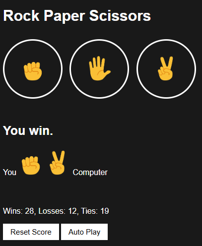

# Rock Paper Scissors Game

A web-based implementation of the classic game **Rock Paper Scissors**, allowing users to play against a computer opponent. This project demonstrates basic web development principles using HTML, CSS, and JavaScript.

## Features

- **Interactive Gameplay**: Play the game by selecting Rock, Paper, or Scissors.
- **Real-Time Score Tracking**: Tracks and displays the number of wins, losses, and ties.
- **Persistent Score**: Utilizes `localStorage` to save the score, even after the browser is closed.
- **Responsive Design**: Optimized for different screen sizes and devices.

## Technologies Used

- **HTML**: Structure of the game interface.
- **CSS**: Styling for a visually appealing and responsive design.
- **JavaScript**: Game logic, score tracking, and interactivity.

## How to Play

1. Open the game in your web browser.
2. Click on the Rock, Paper, or Scissors button to make your move.
3. The game will display the result of the match (Win, Lose, or Tie) along with the moves of both the player and the computer.
4. Check your cumulative score in the score section.
5. Use the **Reset Score** button to clear the game history.

## File Structure

- **`rock-paper-scissors.html`**: The main HTML file containing the structure of the game interface.
- **`rock-paper-scissors.css`**: The CSS file for styling the game interface.
- **`rock-paper-scissors.js`**: The JavaScript file containing game logic and interactivity.

## How to Run

1. Clone the repository or download the project files.
2. Place the files in the same directory, ensuring the correct structure for styles and scripts.
3. Open `rock-paper-scissors.html` in any modern web browser to play.

